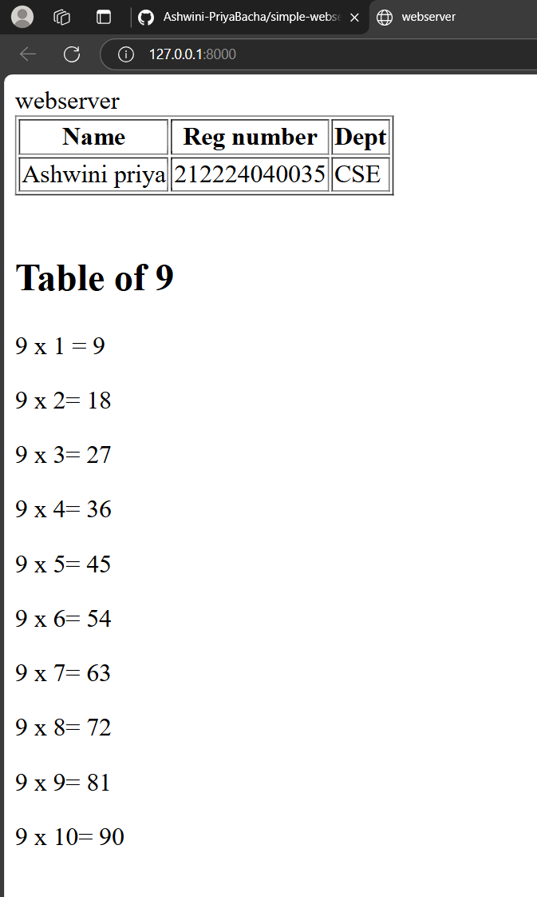

 
# EX01 Developing a Simple Webserver
## Date:05/03/2025

## AIM:
To develop a simple webserver to serve html pages and display the configuration details of laptop.

## DESIGN STEPS:
### Step 1: 
HTML content creation.

### Step 2:
Design of webserver workflow.

### Step 3:
Implementation using Python code.

### Step 4:
Serving the HTML pages.

### Step 5:
Testing the webserver.

## PROGRAM:
```html
<!DOCTYPE html>
<html lang="en">
<head>
    <meta charset="UTF-8">
    <meta name="viewport" content="width=device-width, initial-scale=1.0">
    <title>webserver</title>
</head>
<body>
    <hl>webserver</hl>
    <table border="1">
        <tr>
            <th>Name</th>
            <th>Reg number</th>
            <th>Dept</th>
        </tr>
        <tr>
            <td>Ashwini priya</td>
            <td>212224040035</td>
            <td>CSE</td>
        </tr>
    </table>
    <br>
    <h2>Table of 9</h2>
    <p>9 x 1 = 9</p>
    <p>9 x 2= 18</p>
    <p>9 x 3= 27</p>
    <p>9 x 4= 36</p>
    <p>9 x 5= 45</p>
    <p>9 x 6= 54</p>
    <p>9 x 7= 63</p>
    <p>9 x 8= 72</p>
    <p>9 x 9= 81</p>
    <p>9 x 10= 90</p>
    

</body>
</html>
```
## OUTPUT:


## RESULT:
The program for implementing simple webserver is executed successfully.
